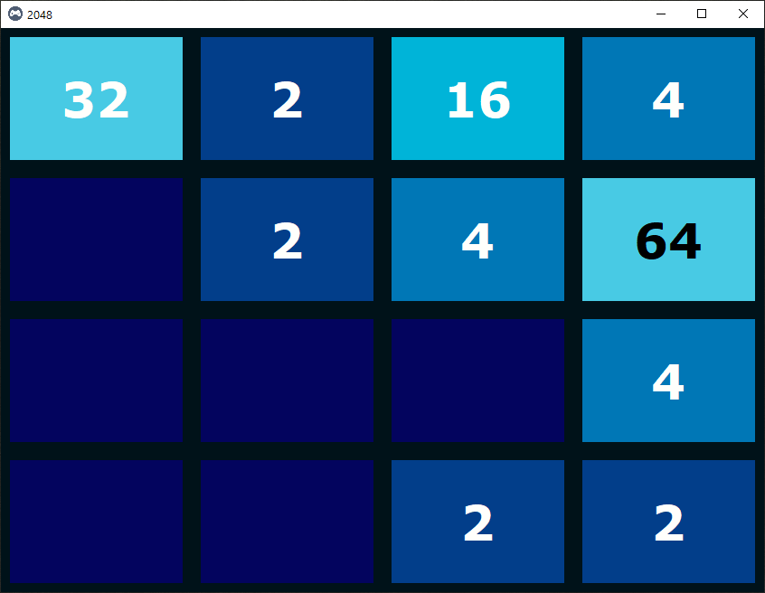
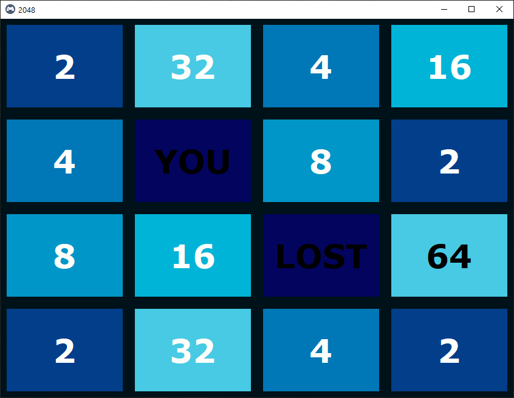

# This game is a python project based based on popular game called **2048**

Instruction for this game is simple but playing this game is quite tough though 

Instruction :  
* Use “w,a,s,d” keys to move the tiles.
* Tiles with the same number merge into one when they touch.
* Add them up to reach 2048!

In this project/game I've used:
* tkinter module
* OOPs concept
* Few matrix/array related algorithms

 

## Screenshot of ongoing game

## Screenshot when lost

### Screenshot when won is not available because as of now I haven't won any match yet, LOL
